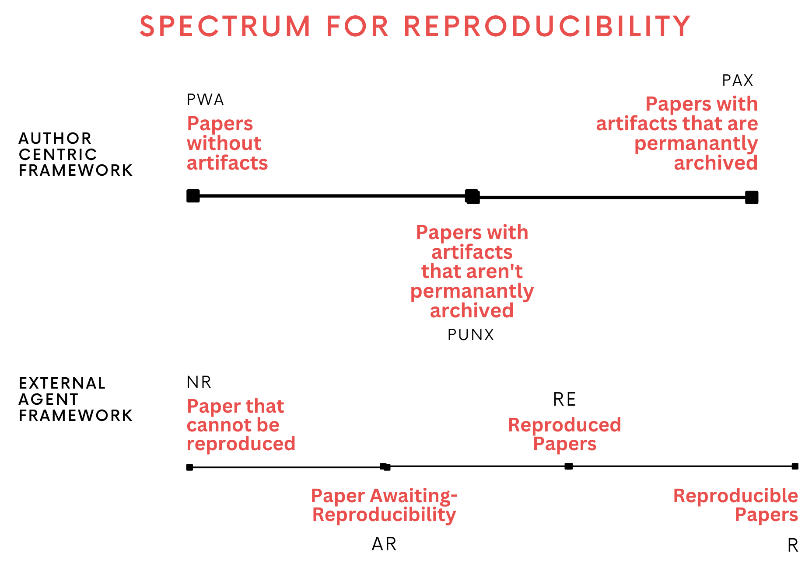

# NLRR
Code, data, and supplemental information for the work titled "Navigating the Landscape of Reproducible Research A Predictive Modeling Study".

### Reproducibility Spectrum

The author-centric framework focuses on acknowledging availability, accessibility, and quality of the artifact available within scientific document to signal satisfying prerequisites to reproduce a paper. The Author-Centric framework within the spectrum includes, $A_i = A_{PWA}$ (Papers without artifacts), $A_{PUNX}$ (Papers with artifacts that aren't permanantly archived), and $A_{PAX}$ (Papers with artifacts that are permanantly archived).

The external-agent framework that presents the reproducibility evaluation status of a paper. This includes $E_i = E_{NR}$ (Paper that cannot be reproduced), $E_{AR}$ (Paper Awaiting-Reproducibility), $E_{R^{Re}}$ (Reproduced paper), and  $E_{R}$ (Reproducible paper).



### Repository structure

```shell
├── data
│   ├── acmpapers_fulltext_labels_04_24.csv
│   ├── dataloader.py
│   ├── __init__.py
│   ├── papers_with_ada_vec.pickle
│   ├── papers_with_badged_information.csv
│   ├── papers_with_longformer_vec.pickle
│   ├── papers_without_badged_information.csv
│   ├── papers_with_sp_vec.pickle
│   └── README.md
├── environment.yml
├── LICENSE
├── media
│   ├── acm_badges_data.png
│   ├── acmbadges_feature_groups.png
│   ├── badge_dist.png
│   ├── feature_importances_exp1_2_3.png
│   ├── permutation_feature_imp_exp1_2_3.png
│   └── reproducibility_spectrum.png
├── models
│   ├── model_auth_centric.pth
│   └── model_ext_agent.pth
├── README.md
├── results
│   ├── phi_author_longformer_model_confidence.pdf
│   ├── phi_author_longformer_model_confidence.png
│   ├── phi_author_model_confidence.pdf
│   ├── phi_author_model_confidence.png
│   ├── phi_external_longformer_model_confidence.pdf
│   ├── phi_external_longformer_model_confidence.png
│   ├── phi_external_model_confidence.pdf
│   ├── phi_external_model_confidence.png
│   └── README.md
└── src
    ├── learning.py
    └── stats.py
```

### Re-run the experiments

If you want to run the statistical tests, first go into the env,

```shell
$ conda env create -f environment.yml
$ conda activate acmbadges
```

once the conda env is setup, run

```shell
$ python -m src.stats
```


If you would like to change the command line arguments, do the following to understand

To understand more about performing the tests of appropriateness, or statistical significance, use the following command
```shell
$ python -m src.stats --help

src/stats.py: Run statistical tests on Scholarly papers to determine
significant observations on latent factors responsible for reproducibility.

options:
  -h, --help            show this help message and exit
  --badged_file_path BADGED_FILE_PATH
                        File path to the badged papers data CSV file.
  --unbadged_file_path UNBADGED_FILE_PATH
                        File path to the unbadged papers data CSV file.
  --run_test {kruskal,shapiro,all}
                        Specify which statistical test to run: Kruskal, Shapiro, or all.
  --feature_type {normal,scaled}
                        Choose the type of features to use: Normal or Scaled.
```

To understand more about training the models and run inference and obtain evaluation metrics, run

```shell
$ python -m src.learning --help

src/learning.py: Train ML/DL mdoels on Scholarly papers to predict author centric labels and external agent labels for reproducibility.

options:
  -h, --help            show this help message and exit
  --badged_file_path BADGED_FILE_PATH
                        File path to the badged papers data CSV file.
  --unbadged_file_path UNBADGED_FILE_PATH
                        File path to the unbadged papers data CSV file.
  --paper_file_path PAPER_FILE_PATH
                        File path to the raw papers text-labels dataframe file.
  --train_model {tree_based,vanilla,surrogate,joint_model_with_logits,all}
                        Specify which learning model to train: Tree Based Model, VanillaNN, or all.
  --tree_based_model {adb,gdb,dt,rf,log}
                        Specify which tree-based ML learning algorithm to train: AdaBoost, Gradient Boosting, Decision Tree, or Random Forest.
  --train_emb_model {nn_x_ada,nn_x_llama3,nn_x_specter,nn_x_longformer,none}
                        Specify which embedding representations to train and learn : NN with X(ADA), NN with X(LlaMa3), or all.
  --feature_type {normal,scaled}
                        Choose the type of features to use: Normal or Scaled.
```

More information on this can be found from `results/` directory.