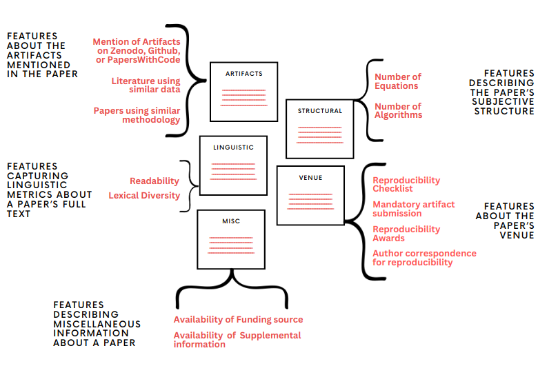
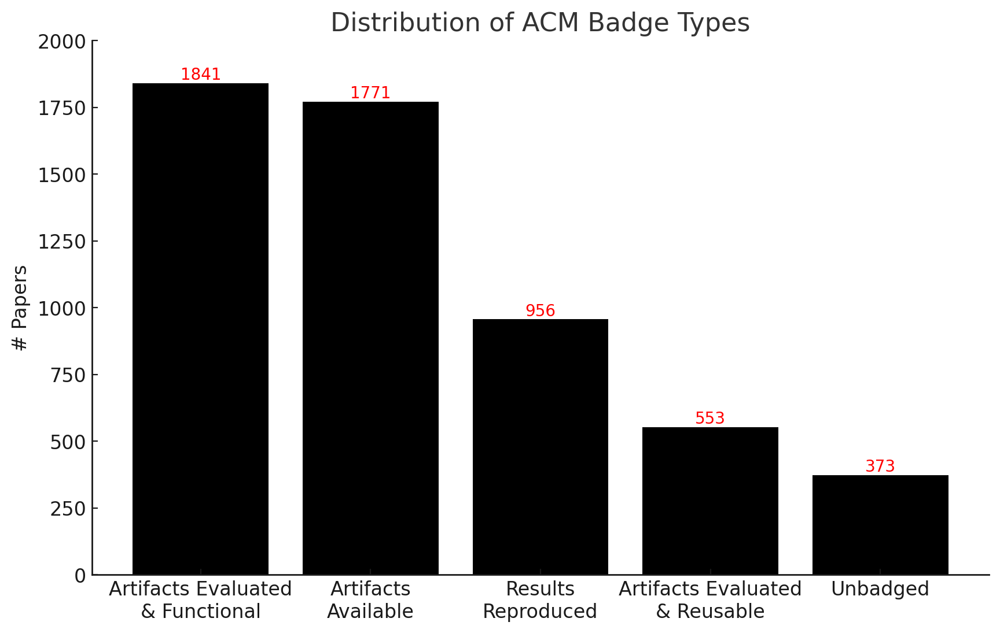
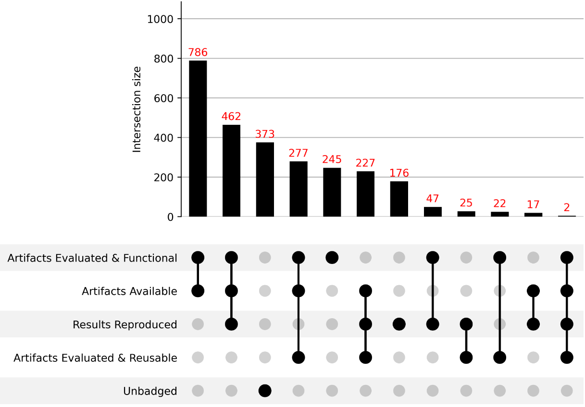

### About the data
In the year 2015, ACM digital library created a task force to address reproducibility concerns centered around rerunning software used in academic works. The task force gathered consensus on problems faced by community when reproducing experiments, and this resulted in the creation of Artifact Reviewing and Badging policy. At the end of 2017, ACM introduced the concept of badges to signal when publications have been successfully reproduced. Articles include artifacts, and they are broadly categorized under the umbrella of availability, evaluation, and validation. Scholarly articles badged as **Artifacts Available** when they are accompanied with artifacts that have been rendered permanently retrievable, **Artifacts Evaluated and Functional**, or **Artifacts Evaluated and Reusable** when the artifacts have been audited, and lastly **Results Reproduced** is given when without the use of author-supplied artifacts, the primary findings of the publication have been validated and independently verified in a later investigation by a person or group other than the authors. The broader goal of building a comprehensive analysis on reproducibility would require a nuanced collection of scholarly articles with varying degrees of information available about the reproducibility of the articles.

### Features in Consideration

### Badges Distribution

### Intersection of original Badge Categories

