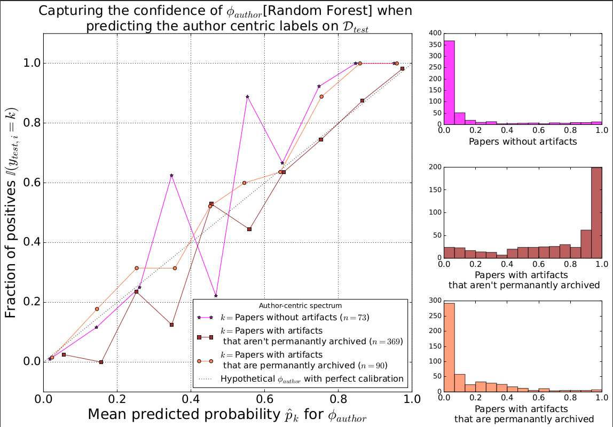
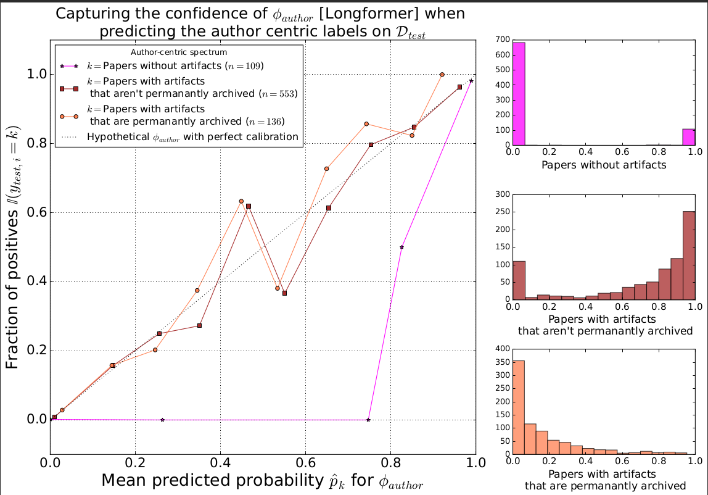
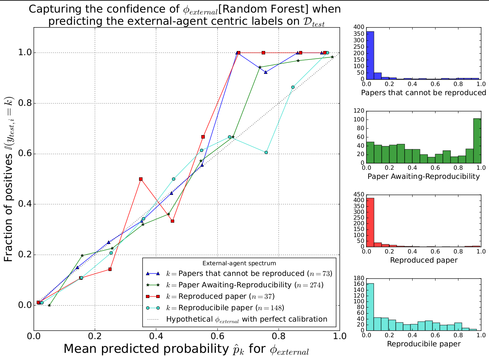
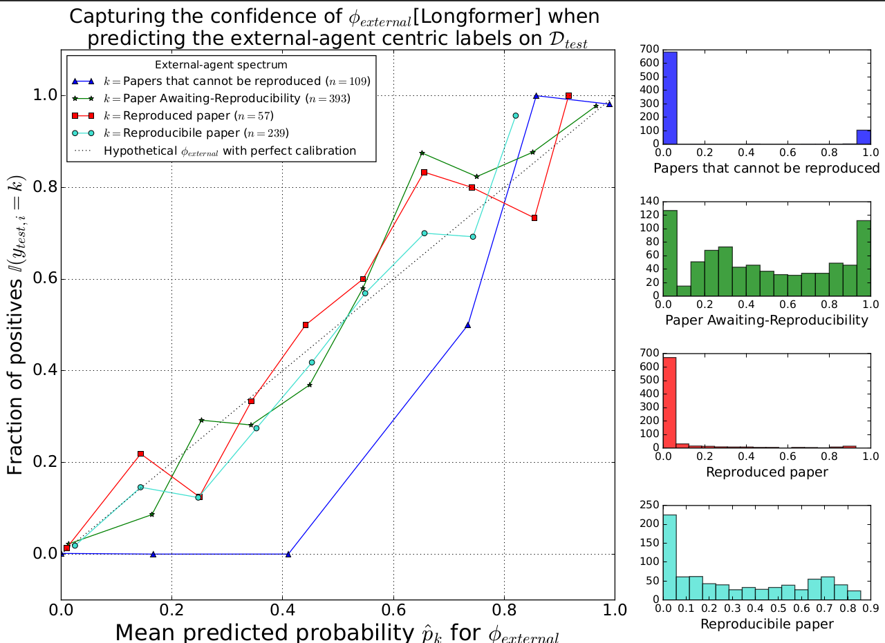

## Results

### 1. Statistical Tests

#### 1.a Tests for appropriateness

**1.a.1. Shapiro-Wilk Test for normality of features on scholarly papers**

| Feature| Statistic |	p-value |
|--------|:------:|:----:|
|Median Readability |0.952613 | 1.565888e-28|
|Number of Algorithms | 0.554016  | 1.731140e-63|
|Number of Equations | 0.244451 | 8.599141e-74|
|Google Scholar citations | 0.100468  | 2.239210e-77|
|Measure of lexical textual diversity | 0.855591  | 4.103254e-44|


**1.a.3 Levene's Test for Homogeneity of Variances grouped by author centric framework**

| Feature| Statistic |	p-value |
|--------|:------:|:----:|
|Median Readability                     | 4.990988  | 6.862850e-03|
|Number of Algorithms                   | 36.773371 | 1.764600e-16|
|Number of Equations                    | 5.258889  | 5.255375e-03|
|Google Scholar citations       | 1.714010  | 1.803412e-01|
|Measure of lexical textual diversity   | 1.290552  | 2.752913e-01|

**1.a.4 Levene's Test for Homogeneity of Variances grouped by external agent framework**

| Feature| Statistic |	p-value |
|--------|:------:|:----:|
|Median Readability                    | 4.153057  | 6.039707e-03|
|Number of Algorithms                  | 29.537040 | 8.830013e-19|
|Number of Equations                   | 6.959335  | 1.158253e-04|
|Google Scholar citations      | 4.195924  | 5.690491e-03|
|Measure of lexical textual diversity  | 0.283903  | 8.370575e-01|


#### 1.b Non-Parametric Test for Significance of features across groups

#### 1.b.1 Kruskal-Wallis test to identify differences in author centric framework

| Feature| Statistic | p-value |
|--------|:------:|:----:|
|Median Readability                   | 693.261011 | 2.885920e-151|
|Number of Algorithms                 |  43.248067 |  4.062576e-10|
|Number of Equations                  |  15.267781 |  4.837751e-04|
|Google Scholar citations - Y2023     |  35.751811 |  1.724221e-08|
|Measure of lexical textual diversity |  94.078257 |  3.725342e-21|


#### 1.b.2 Kruskal-Wallis test to identify group differences in external agent framework

| Feature| Statistic | p-value |
|--------|:------:|:----:|
|Median Readability                   | 697.771459 | 6.386612e-151|
|Number of Algorithms                 |  54.607980 |  8.324174e-12|
|Number of Equations                  |  28.063838 |  3.521685e-06|
|Google Scholar citations - Y2023     | 142.053160 |  1.363764e-30|
|Measure of lexical textual diversity | 108.002775 |  2.952022e-23|


### 2. Training Tree-based Machine Learning models

From the root of the project, run
```shell
$ python -m src.learning --train_model="tree_based"
````

and you get the following

```shell
INFO:data.dataloader:------------------------------
INFO:data.dataloader:Loading ACM Badges data......
INFO:data.dataloader:Assigning Author centric labels......
INFO:data.dataloader:Assigning External agent centric labels......
INFO:data.dataloader:Preparing data loaders......
INFO:data.dataloader:------------------------------

INFO:__main__:Training Tree Based Model...
INFO:__main__:Tree Model CLF report for author centric framework
                                                        precision    recall  f1-score   support

                              Papers without artifacts       0.81      0.69      0.74       109
Papers with artifacts that aren't permanantly archived       0.84      0.95      0.89       553
   Papers with artifacts that are permanantly archived       0.68      0.40      0.51       136

                                              accuracy                           0.82       798
                                             macro avg       0.78      0.68      0.71       798
                                          weighted avg       0.81      0.82      0.81       798

INFO:__main__:------------------------------
INFO:__main__:Tree Model CLF report for external agent labels
                                  precision    recall  f1-score   support

Papers that cannot be reproduced       0.78      0.69      0.73       109
  Paper Awaiting-Reproducibility       0.83      0.80      0.81       393
                Reproduced paper       0.68      0.56      0.62        57
             Reproducibile paper       0.66      0.76      0.70       239

                        accuracy                           0.75       798
                       macro avg       0.74      0.70      0.72       798
                    weighted avg       0.76      0.75      0.76       798

INFO:__main__:------------------------------
```

### 2. Training Parametric models with Scaled features

The features used for the parametric models are the scaled versions of the entire feature set for each paper.

From the root of the project, run
```shell
$ python -m src.learning --train_model="vanilla"
````

and you get the following

```shell
INFO:data.dataloader:------------------------------
INFO:data.dataloader:Loading ACM Badges data......
INFO:data.dataloader:Assigning Author centric labels......
INFO:data.dataloader:Assigning External agent centric labels......
INFO:data.dataloader:Preparing data loaders......
INFO:data.dataloader:------------------------------

INFO:__main__:Training ACMnn Vanilla Model...
INFO:__main__:------------------------------
INFO:__main__:ACMnn Vanilla Model CLF report for author centric framework
                                                        precision    recall  f1-score   support

                              Papers without artifacts       0.76      0.65      0.70       109
Papers with artifacts that aren't permanantly archived       0.83      0.92      0.87       553
   Papers with artifacts that are permanantly archived       0.63      0.42      0.50       136

                                              accuracy                           0.80       798
                                             macro avg       0.74      0.66      0.69       798
                                          weighted avg       0.79      0.80      0.79       798

INFO:__main__:------------------------------
INFO:__main__:ACMnn Vanilla Model CLF report for external agent labels
                                  precision    recall  f1-score   support

Papers that cannot be reproduced       0.77      0.66      0.71       109
  Paper Awaiting-Reproducibility       0.80      0.78      0.79       393
                Reproduced paper       0.73      0.61      0.67        57
             Reproducibile paper       0.60      0.69      0.64       239

                        accuracy                           0.72       798
                       macro avg       0.72      0.68      0.70       798
                    weighted avg       0.73      0.72      0.72       798

INFO:__main__:------------------------------
```


### 5. Showing predictive probabilities best performing models $\phi_{author}$, and $\phi_{external}$

Ideally, showcasing the model consistency in terms of the predictive probability is generally a good approach when it comes to understanding where a model is not confident. The plots below outline the confidence of predictions for $\phi_{author}$, and $\phi_{external}$ while predicting the framework labels on Random Forest, and LongFormer models.

```math
\hat{p}_k = \frac{1}{n_k} \sum_{i=1}^{n_k} \hat{p}_{ik}
```

```math
\text{Fraction of Positives}_k = \frac{1}{n_k} \sum_{i=1}^{n_k} \mathbb{I}(y_i = k)
```

* **$\hat{p}_k$:** The mean predicted probability for class $k$.
* $n_k$​: The number of instances belonging to class $k$.
* **$\hat{p}_{ik}$​:** The predicted probability of instance $i$ belonging to class $k$.
* **$\mathbb{I}(y_i = k)$:** An indicator function that is 1 if the true label $y_i$​ matches class 1, otherwise 0



<br />


<br/>


<br/>

